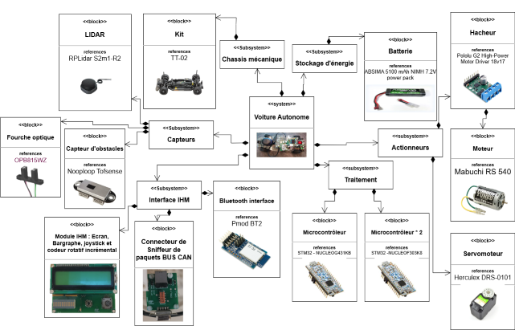
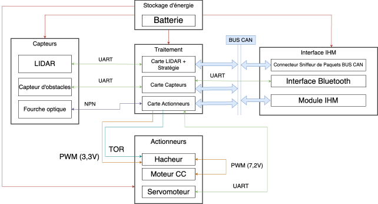

# Projet de Voiture Autonome - COVAPSY 🚗


Ce dépôt contient le code développé par l'équipe **GE1** en deuxième année du BUT GEII de l'IUT de Cachan pour concevoir une voiture autonome dans le cadre de la compétition COVAPSY. Le règlement officiel de la course est disponible [ici](https://ajuton-ens.github.io/CourseVoituresAutonomesSaclay/).

---

\tableofcontents

## TODO
- [ ] Intégration du connecteur Bluetooth
- [ ] Programmation et intégration de la fourche optique
- [ ] Programmation et intégration des capteurs d'obstacles arrières
- [ ] Optimisation du décodage des trames LiDAR
- [ ] Révision de l'algorithme de conduite autonome

## Structure des Branches Git

Nous avons organisé le projet en différentes branches pour faciliter la gestion du code et le développement collaboratif :

1. **main**
Contient la version stable du projet, prête pour des démonstrations ou des tests finaux.

2. **code_moteur**
Développement et tests des fonctions liées au moteur à courant continu, au servomoteur Herkulex, et à la fourche optique.

3. **ihm**
Développement et validation de l'interface homme-machine (IHM).

4. **integration**
Intégration du code des différentes branches pour une implémentation sur le véhicule complet.

5. **lidar**
Développement et validation des fonctions de communication et de traitement des données du LiDAR.

6. **simulation**
Développement et tests des algorithmes de stratégie autonome en simulation, via Webots.

## Organisation du dépôt

Voici la structure des fichiers et répertoires principaux du dépôt :

```plaintext
├── code_carte_moteur/             # Code source de la carte actionneur
├── connecteur_bluetooth/          # Code source de la carte capteur
├── multiperiph_base_test_tp/      # Code source de la carte stratégie et LiDAR
├── README.md                      # Documentation principale
```

# Caractéristiques de la voiture​


Diagramme de définition de bloc SysML de la voiture autonome​

#  Architecture globale : Le schéma synoptique 


Schéma synoptique de communication​

# Guide d'Installation
## Logiciel :
  - STM32CubeIDE 1.15.1 pour la programmation embarquée.
  - Python 3.8+ pour les scripts de simulation.
  - Webots pour tester les algorithmes en simulation.

### Étapes
1. Clonez le dépôt Git :
```bash
git clone https://github.com/dprosperin/Course_Voitures_Autonomes.git
cd Course_Voitures_Autonomes
```

2.	Changez de branche selon vos besoins :
```bash
git checkout <nom_de_la_branche>
```
3.	Suivez les instructions spécifiques à chaque branche dans leurs sous-dossiers respectifs.

# Développé par
* __David PROSPERIN__ : <david.prosperin@universite-paris-saclay.fr>
* __Mateo MUNOZ__ : <joseph.munoz-saltos@universite-paris-saclay.fr>
* __Yassine MESBAHI__ : <yassine.mesbahi@universite-paris-saclay.fr>